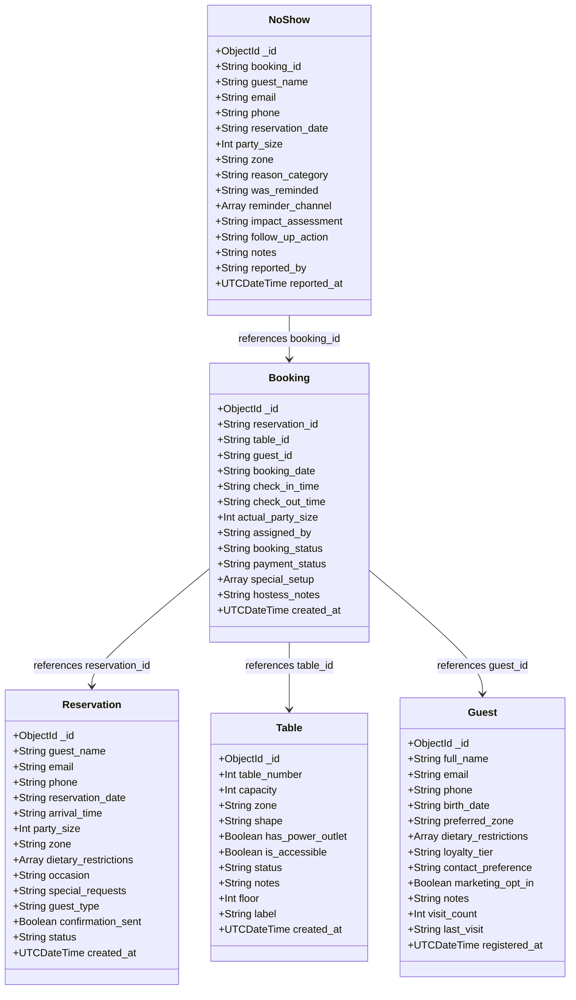

# DineBook — Class Diagram (MongoDB Document Model)

Since DineBook uses MongoDB (a NoSQL document database), there is no traditional ER diagram with foreign keys. Instead, we present a **Class Diagram** showing the document structure and application-level references between collections.

## Class Diagram (Mermaid)

## Collection Relationships

| Collection | Type | References |
|-----------|------|-----------|
| reservations | Catalog | Standalone |
| tables | Catalog | Standalone |
| guests | Catalog | Standalone |
| bookings | Transaction | reservation_id, table_id, guest_id (string refs) |
| noshows | Transaction | booking_id (string ref) |

Application-level joins are performed in PHP using `findOne()` by converting the stored string ID to `MongoDB\BSON\ObjectId`.
