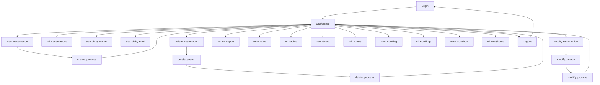

# DineBook — Navigation Diagram

## Screen IDs

| ID | Screen | File |
|----|--------|------|
| L01 | Login | auth/login.php |
| D01 | Dashboard | index.php |
| R01 | Reservation Create | reservations/create.html |
| R02 | Reservation Report | reservations/report.php |
| R03 | Reservation Search (Name) | reservations/search.php |
| R04 | Reservation Search (Field) | reservations/search_v2.php |
| R05 | Reservation Search (GET) | reservations/search_v3.php |
| R06 | Reservation Delete | reservations/delete.php |
| R07 | Reservation Modify | reservations/modify.php |
| R08 | Reservation JSON Report | reservations/report_json.php |
| T01–T07 | Table CRUD screens | tables/*.php |
| G01–G07 | Guest CRUD screens | guests/*.php |
| B01–B07 | Booking CRUD screens | bookings/*.php |
| N01–N07 | No-Show CRUD screens | noshows/*.php |

## Navigation Flow (Mermaid)

Every page includes the Bootstrap navbar allowing direct navigation to any entity's report page, plus a "Back to Menu" link returning to D01.
