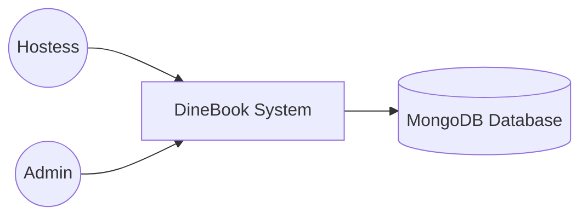
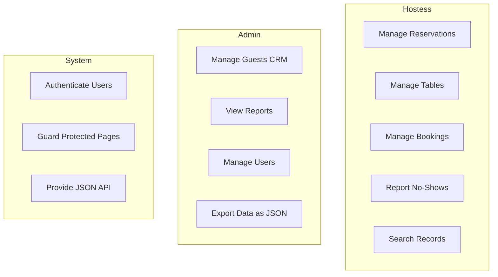
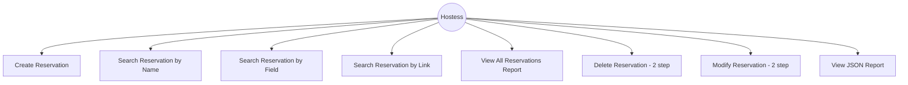

# DineBook — Use Case Diagrams

## Level 0 — System Context

The DineBook system is used by Hostess staff and Admins to manage restaurant reservations, tables, guests, bookings, and no-show reports. All data is stored in MongoDB.

## Level 1 — Main Use Cases per Actor

## Level 2 — CRUD Use Cases for Reservations

## Level 3 — Detailed: "Make Reservation"

**Use Case**: Create Reservation
**Actor**: Hostess
**Preconditions**:
- User is logged in (session active)
- MongoDB is running and accessible

**Main Flow**:
1. Hostess navigates to Reservations > New Reservation
2. System displays form with 12 fields (text, email, date, select, radio, checkbox, textarea)
3. Hostess fills in all required fields (guest_name, email, phone, date, time, party_size, zone)
4. Hostess optionally fills dietary restrictions, occasion, special requests, guest type, confirmation
5. Hostess clicks "Create Reservation"
6. System validates required fields server-side
7. System inserts document into MongoDB `reservations` collection with `created_at` timestamp
8. System displays success alert with reservation ID
9. Hostess can create another or return to menu

**Alternative Flow — Validation Error**:
- At step 6, if required fields are empty, system shows alert-danger messages and a "Go Back" link
- Hostess corrects and resubmits

**Postconditions**:
- New reservation document exists in MongoDB
- Reservation has status "active" and created_at timestamp
