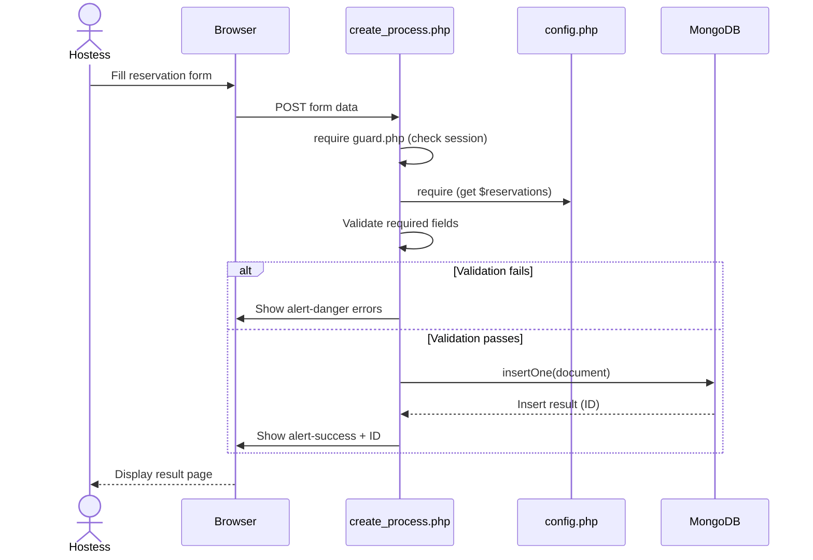
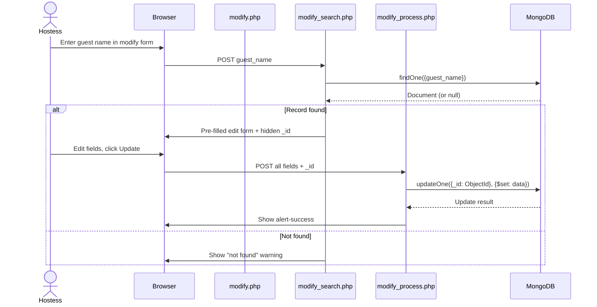
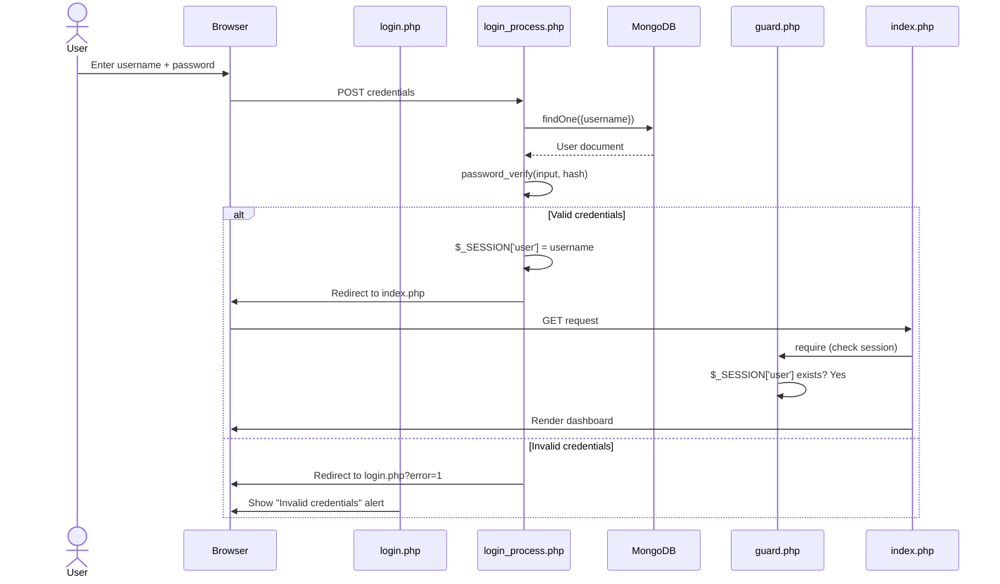

# DineBook — Sequence Diagrams

## 1. Create Reservation

```mermaid
sequenceDiagram
    actor Hostess
    participant Browser
    participant create_process.php
    participant config.php
    participant MongoDB

    Hostess->>Browser: Fill reservation form
    Browser->>create_process.php: POST form data
    create_process.php->>create_process.php: require guard.php (check session)
    create_process.php->>config.php: require (get $reservations)
    create_process.php->>create_process.php: Validate required fields
    alt Validation fails
        create_process.php->>Browser: Show alert-danger errors
    else Validation passes
        create_process.php->>MongoDB: insertOne(document)
        MongoDB-->>create_process.php: Insert result (ID)
        create_process.php->>Browser: Show alert-success + ID
    end
    Browser-->>Hostess: Display result page
```

## 2. Modify Reservation (2-step)

```mermaid
sequenceDiagram
    actor Hostess
    participant Browser
    participant modify.php
    participant modify_search.php
    participant modify_process.php
    participant MongoDB

    Hostess->>Browser: Enter guest name in modify form
    Browser->>modify_search.php: POST guest_name
    modify_search.php->>MongoDB: findOne({guest_name})
    MongoDB-->>modify_search.php: Document (or null)
    alt Record found
        modify_search.php->>Browser: Pre-filled edit form + hidden _id
        Hostess->>Browser: Edit fields, click Update
        Browser->>modify_process.php: POST all fields + _id
        modify_process.php->>MongoDB: updateOne({_id: ObjectId}, {$set: data})
        MongoDB-->>modify_process.php: Update result
        modify_process.php->>Browser: Show alert-success
    else Not found
        modify_search.php->>Browser: Show "not found" warning
    end
```

## 3. Login + Session Guard

```mermaid
sequenceDiagram
    actor User
    participant Browser
    participant login.php
    participant login_process.php
    participant MongoDB
    participant guard.php
    participant index.php

    User->>Browser: Enter username + password
    Browser->>login_process.php: POST credentials
    login_process.php->>MongoDB: findOne({username})
    MongoDB-->>login_process.php: User document
    login_process.php->>login_process.php: password_verify(input, hash)
    alt Valid credentials
        login_process.php->>login_process.php: $_SESSION['user'] = username
        login_process.php->>Browser: Redirect to index.php
        Browser->>index.php: GET request
        index.php->>guard.php: require (check session)
        guard.php->>guard.php: $_SESSION['user'] exists? Yes
        index.php->>Browser: Render dashboard
    else Invalid credentials
        login_process.php->>Browser: Redirect to login.php?error=1
        login.php->>Browser: Show "Invalid credentials" alert
    end
```
